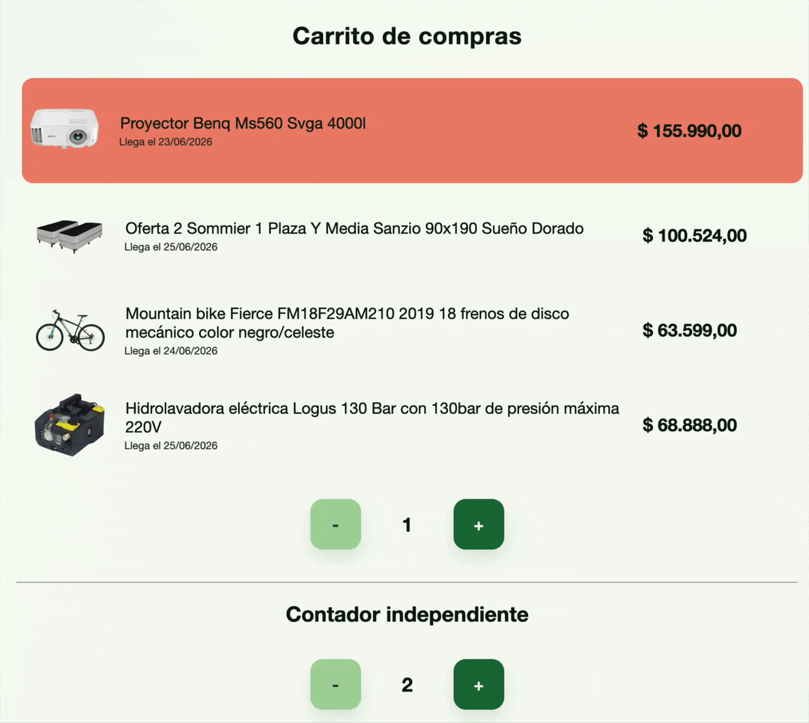
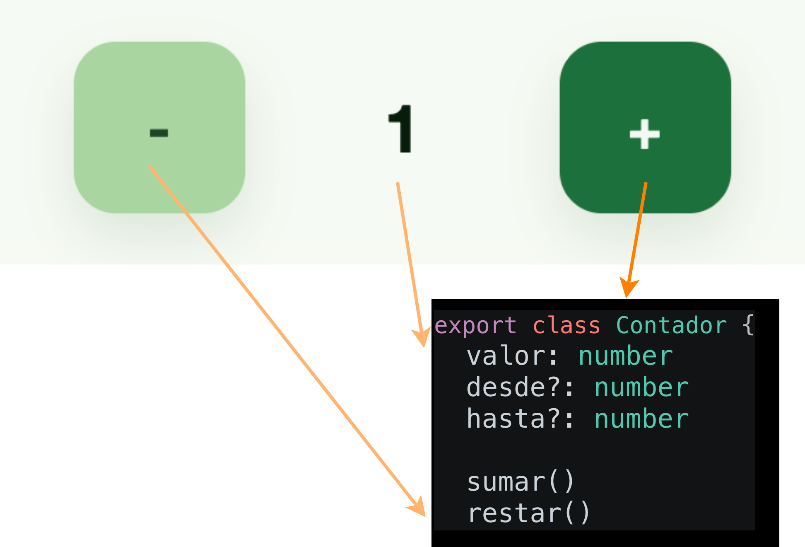
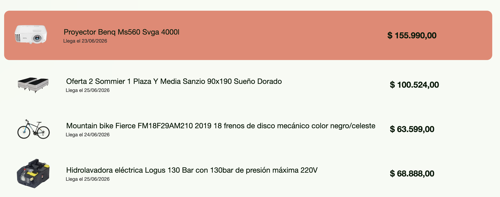
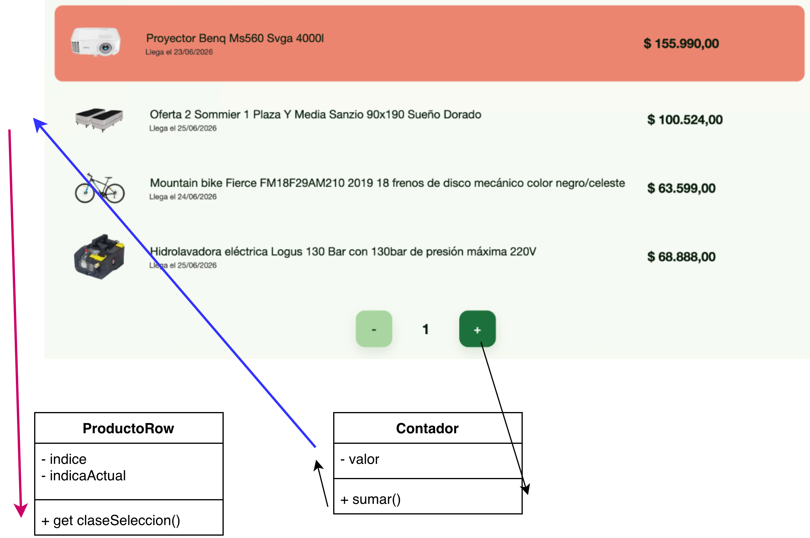

# 🛍️ Carrito de compras en Pelela

[](https://github.com/uqbar-project/eg-carrito-compras-pelela/actions/workflows/ci.yml)



## 🚀 Cómo ejecutarlo

Como de costumbre

```bash
nvm use
pnpm install
pnpm dev
```

Abrí tu navegador e ingresá a [http://localhost:5173](http://localhost:5173) para ver la aplicación funcionando en vivo.

## 1️⃣ ¿Qué contás?

El **contador** es un componente Pelela que sabe

- llevar la cuenta de un número
- sumar 1
- restar 1
- y si le pasamos un límite mínimo y máximo vuelve a comenzar desde el principio




## 🛒 El carrito de compras

A su vez, el carrito de compras tiene

- una lista de productos
- y mantiene dos índices, el primero es el del producto seleccionado...
- y el segundo solo muestra que cada componente mantiene su propio estado



## 🧃 Componente Producto

```html
<div for-each="producto of productos" index="indiceActual">
  <producto-row prop-producto="producto" prop-indice-actual="indiceActual" prop-indice="indice"></producto-row>
</div>
```

Los productos salen de una lista (para este ejemplo hardcodeada). Por otra parte, queremos que cada fila de un producto se delegue en otro componente, que será **otra tríada**:

- un archivo .pelela que debe tener como elemento raíz el tag `component` (no puede tener otro elemento padre)
- un archivo .ts que representa el view model
- y opcionalmente un archivo .css que **funciona de manera aislada del resto de los componentes**

En este caso usamos

- camel case para definir la clase view model: ProductoRow
- kebab case para los archivos: `producto-row.ts`, `producto-row.pelela`, `producto-row.css` y para utilizarlo dentro de nuestro archivo pelela: `<producto-row>` abriendo y cerrando los tags para formar un HTML 5.0 válido.

Para crear un componente tenés una instrucción específica del CLI:

```bash
pelela new --component NombreDelComponente
# o...
pelela new -c NombreDelComponente
# ...sin css
pelela new -c NombreDelComponente --no-css
```

El nombre del componente sigue la convención camel case, en caso de duda: `pelela new --help` o `pelela new -h`.

### Parámetros del componente

El componente hijo recibe el producto, el índice y si es el producto seleccionado (`indiceActual`), que sale de la propiedad `index` del `for-each`. Todas esas propiedades se pasan mediante la definición

**prop-xxx**: donde `prop` indica que es una propiedad que se pasa del padre al hijo, y xxx es el nombre de la propiedad que se define en el hijo, que debe existir (de lo contrario te aparecerá una página de error)

Eso nos permite definir una clase específica para marcar la fila como "seleccionada"

```ts
get seleccionado() {
  return this.indiceActual + 1 === this.indice
}

get claseSeleccion() {
  return this.seleccionado ? 'elegido' : 'normal'
}
```

El componente pelela usa una clase dinámica (`bind-class`):

```html
<div class="container" bind-class="claseSeleccion">
```

## 🫂 La integración entre el contador y el carrito

El segundo contador es independiente, pero el primero queremos que se asocie a la lista de productos, entonces, el contador

- tiene que ir desde 1 hasta la cantidad de productos
- por otra parte, cuando subamos o bajemos el número del contador, eso **debe disparar cambios en el carrito**

```html
<div for-each="producto of productos" index="indiceActual">
  <producto-row prop-producto="producto" prop-indice-actual="indiceActual" prop-indice="indice"></producto-row>
</div>
<contador link-valor="indice" const-desde="1" prop-hasta="cantidadProductos"></contador>
```

Definimos entonces:

- **link-valor**: link nos indica que la propiedad `valor` es **reactiva**, los cambios del hijo se propagan al padre para disparar cambios (en este caso a la fila del producto representada por `producto-row`)
- **const-desde**: como queremos pasar como constante el valor numérico 1, usamos el prefijo const, seguido de la propiedad `desde` que debe existir en el componente hijo
- **prop-hasta**: la cantidad de productos necesita un método get propio, ya que Pelela no soporta expresiones, solo propiedades. En este caso usamos un prop porque **no vamos a hacer cambios y queremos indicar que no habrá reactividad**. Eso también acota la cantidad de eventos que se pasan entre componentes y mantiene así una buena performance.



## Navegación hacia la vista de detalle

Al hacer click sobre una fila, queremos navegar hacia una vista especial de detalle con más información de un producto. Para eso, asociamos al div un nuevo evento `click` en el archivo `producto-row.pelela`:

```html
<div class="container" bind-class="claseSeleccion" click="irADetalle">
```

El método irADetalle dispara la navegación al producto:

```ts
  irADetalle() {
    router.navigateTo(`/producto/${this.producto.id}`)
  }
```

Navegaremos entonces a la ruta `/producto/3` donde `3` es el identificador del producto.

## Routing en Pelela

El archivo `routes.ts` nos permite definir un mapa de rutas -> componentes Pelela:

```ts
export const routes: RouteDefinition[] = [
  { path: '/', component: Home },
  { path: '/producto/:id', component: Detail },
  { path: '*', component: Home },
]
```

- por defecto, la URL raíz (`/`) se asocia al componente Home (recordamos que un componente es una tríada `.pelela`, `.ts` y opcionalmente un `.css`)
- `/producto/:id` define una ruta con una parte fija: `producto` y otra dinámica, que se asocia a un parámetro `id`
- cualquier otra ruta: (*) nos lleva al Home. Si por error escribimos `http://localhost:5173/cualquiera` el router de Pelela nos dirigirá hacia la página home. Esta ruta se suele llamar wildcard o catch-all route en otras tecnologías

## Vista de detalle

El view model provee un método `initialize` para disparar eventos especiales. En este caso, capturamos el valor del parámetro como `id` para buscar en el repositorio la información de un producto (recordemos que podemos solo pasar un mapa de strings de una ruta a otra, no objetos)

```ts
  initialize() {
    const { id } = router.urlParameters()
    const producto = productoRepository.getById(Number(id))
    if (!producto) {
      throw new Error(`Producto con id ${id} no encontrado`)
    }
    this.producto = producto
  }
```

El repositorio es un _singleton_ que permite recuperar la información de todos los productos del carrito.
